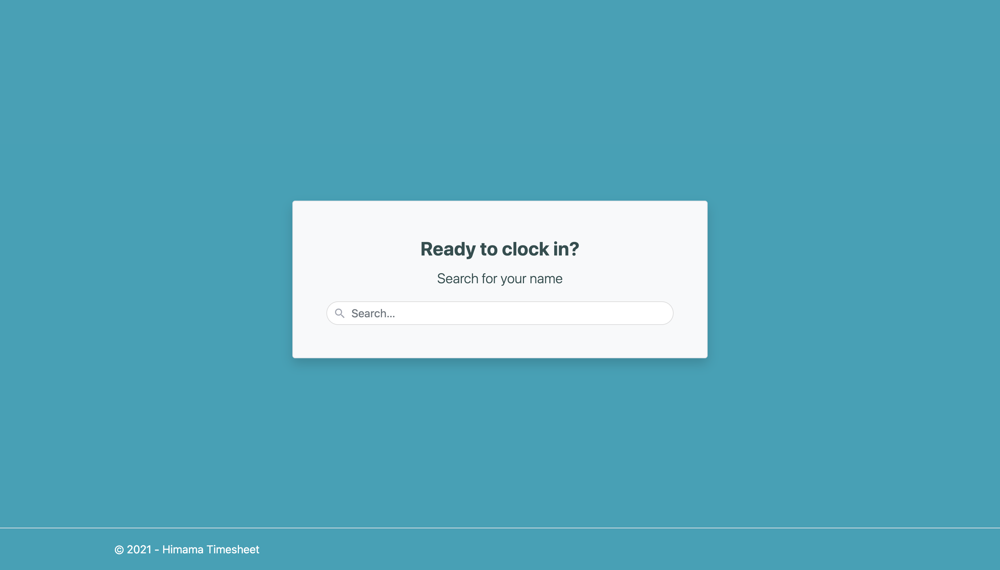
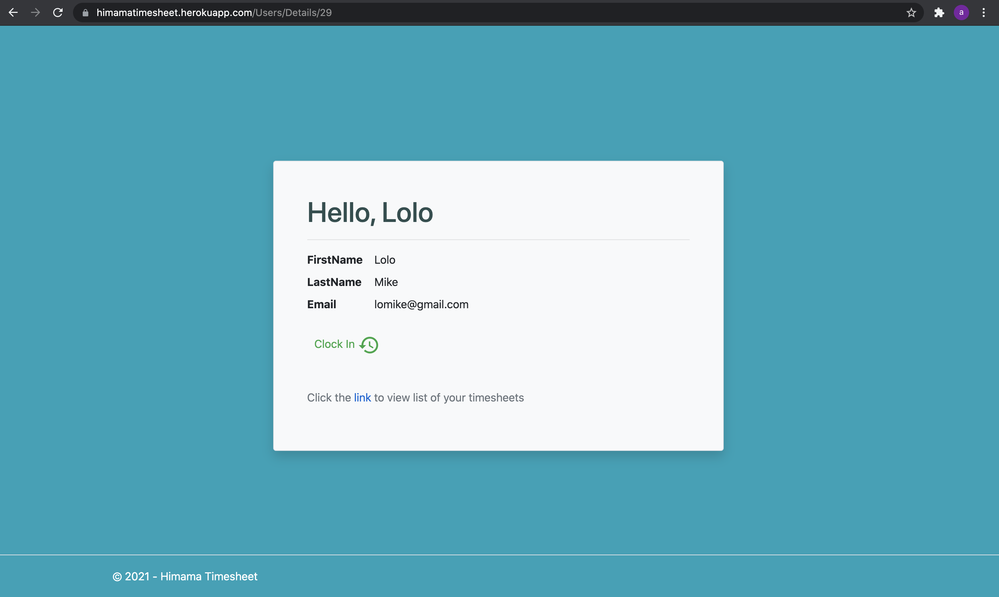

# Himama TimeSheet - App

This application is used to track time by a user. Features include allows new user creation, clock-in/out, display of attendance entries, and the ability to update entries. [You can read all about the thought process here](./Response.md)

Home Page                                             |  User Details Page
:----------------------------------------------------:|:------------------------------------------------------:
 |  

# Table of Contents

- [Getting Started](#getting-started)
- [Technology Stack](#technology-stack)
- [Run The Application](#run-the-application)
- [Resources](#resources)

## Getting Started
This is an mvc application built with [.Netcore MVC](https://docs.microsoft.com/en-us/aspnet/core/tutorials/first-mvc-app/start-mvc?view=aspnetcore-5.0&tabs=visual-studio). The database is [Postgres DB](https://www.heroku.com/postgres) and it's been deployed to [heroku](https://heroku.com/)

## Technology Stack

1. .NetCore MVC
2. Postgres
3. EntityFramework Core
4. Heroku
5. Docker

## Run The Application

1. Clone the [**repository here**](https://github.com/syntiara/Himama.Timesheet.git)
1. Open the project in visual studio
2. [**cd**] into the root of the **project directory**
3. run dotnet restore to restore package dependencies
4. Click run to start the project

## Resources

1. [Deploying .netcore to heroku](https://dev.to/alrobilliard/deploying-net-core-to-heroku-1lfe)
2. [Github Action - build, push and release a docker container to heroku](https://github.com/marketplace/actions/build-push-and-release-a-docker-container-to-heroku)